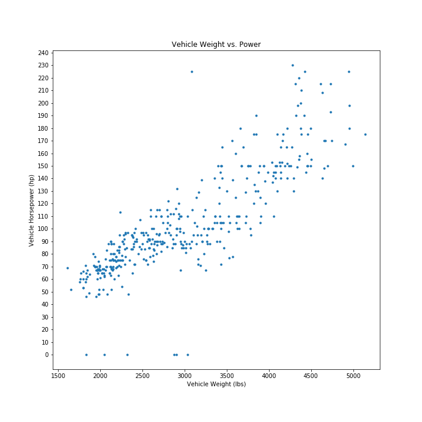

The plot is very clear, no glaring ambiguties. Although: the 6 or so points at the bottom of the plot *must* be errors, right? If they aren't, some sort of explanation in a caption or in the readme with the plot would really be necessary. 0 horsepower doesn't make a lot of sense for a 1.5 ton car.

For the layout of the plot, the axis labels are a bit small for my taste. Also, the title is redundant - I can already get that information by reading the axis labels.

